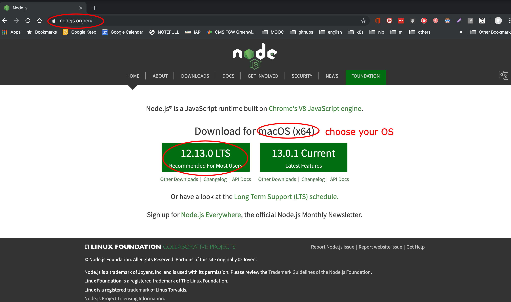
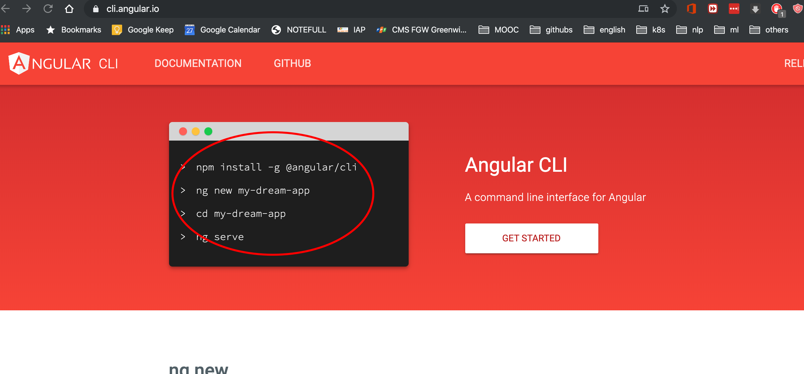
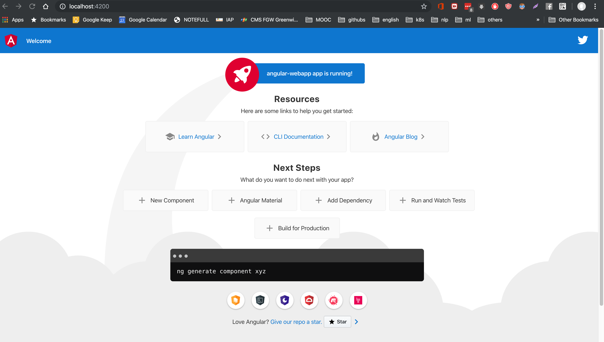

# Angular Webapp

A Single Page Application for tracking vehicle

---

## Outline

- Requirements
- Installation: NodeJS, Angular CLI
- Create an Angular project
- Containerization the project

---

## Requirements

- Installed Softwares :
  - Docker (already installed)
  - Docker Compose (already installed)
  - NodeJS
  - Angular CLI
  - Visual Studio Code (already installed)
- Basic Knowledge:
  - Docker
  - Javascrip, CSS, HTML
  - Typescript

---

## NodeJS Installation



---

## NodeJS Version Checking

Checking `node`'s version and `npm`'s version

```bash
$ node -v
v12.13.0

$ npm -v
6.12.0
```

---

## Angular CLI



--- 

## Create a new Angular project

```bash
$ ng new angular-webapp
```

Use Visual Studio Code to open folder `angular-webapp`

- Type `y` (yes) or `Enter` to any question showing up.

When the creation process is done, start the webapp with the following command

```bash
$ ng serve
```

Open your browser with `http://localhost:4200`

Terminate the website by typing `Ctrl + C`

---

## The Webapp Interface



---

## Build the Webapp for Production

```bash
ng build --prod
```

This process compiles an Angular project's source to a bundble which includes `.html`, `.css`, `.cs` files for production.

When it is done, the production files are generated in folder `dist`

---

## Create Docker Image of the Webapp

We create an image of the webapp by composing `Dockerfile`. 
Create an `Dockerfile` by the command

```bash
$ touch Dockerfile
```

---

## What systems will run on the container?

The Webapp

Nginx

- Webserver
- Reverse Proxy
- Load Balancer

---

## Add code to Dockerfile

```docker
# base image
FROM nginx:1.14.0-alpine

MAINTAINER Ho Tuan Dung "htdung820@gmail.com"

## installing some required Python packages
RUN apk --no-cache add \
      python2 \
      py2-pip && \
    pip2 install j2cli[yaml]
RUN apk add --update bash && rm -rf /var/cache/apk/*

# Deploy the production files of the webapp
RUN rm -rf /usr/share/nginx/html/*
COPY /dist/angular-webapp /usr/share/nginx/html

# Deploy configuration files of Nginx
COPY nginx.conf.j2 /templates/
COPY docker-entrypoint.sh /

ENTRYPOINT ["/docker-entrypoint.sh"]
CMD ["nginx", "-g", "daemon off;"]
```

---

## Another required files: `nginx.conf.j2`

```bash
$ touch nginx.conf.j2
```

Add the following content

```nginx
events {
  worker_connections  4096;  ## Default: 1024
}

http {
   map $http_upgrade $connection_upgrade {
       default upgrade;
      '' close;
   }

   include /etc/nginx/mime.types;

   server {
      listen 80;

      location /api {
        proxy_set_header        Host $host;
        proxy_set_header        X-Real-IP $remote_addr;
        proxy_set_header        X-Forwarded-For $proxy_add_x_forwarded_for;
        proxy_set_header        X-Forwarded-Proto $scheme;

        proxy_read_timeout  90;

        proxy_http_version 1.1;  # recommended with keepalive connections - http://nginx.org/en/docs/http/ngx_http_proxy_module.html#proxy_http_version

        # WebSocket proxying - from http://nginx.org/en/docs/http/websocket.html
        proxy_set_header Upgrade $http_upgrade;
        proxy_set_header Connection $connection_upgrade;
      }

      location / {
         root /usr/share/nginx/html;
      }
    }
}
```

--- 

## Another required files: `docker-entrypoint.sh`

Add `docker-entrypoint.sh` with the following content 

```bash
#!/bin/bash -e
j2 /templates/nginx.conf.j2 > /etc/nginx/nginx.conf
exec "$@"
```

